# Traffic Sign Classifier

The goal of this project is to build and train a Convolutional Neural Network model to classify traffic signs from the German Traffic Sign dataset and achieve a test set prediction accuracy greater than 93%.
---

**Build a Traffic Sign Recognition Project**

The goals / steps of this project are the following:
* Load the data set (see below for links to the project data set)
* Explore, summarize and visualize the data set
* Design, train and test a model architecture
* Use the model to make predictions on new images
* Analyze the softmax probabilities of the new images
* Summarize the results with a written report

### Basic summary of the data set

* Download dataset: [traffic-signs-data.zip](https://d17h27t6h515a5.cloudfront.net/topher/2017/February/5898cd6f_traffic-signs-data/traffic-signs-data.zip)
* The size of training set is 34799
* The size of validation set is 4410
* The size of test set is 12630
* The shape of a traffic sign image is (32, 32, 3)
* The number of unique classes/labels in the data set is 43. The mapping of traffic sign names to class id can be found here: [signnames.csv](./signnames.csv)

### Exploratory visualization on the data set

Samples from the dataset

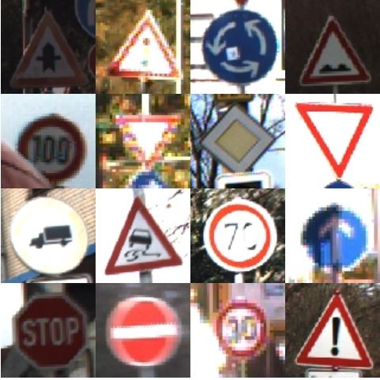

The histogram representation shows the data distribution of the training data. Each bin represents one class (traffic sign) and how many samples are in that class. 

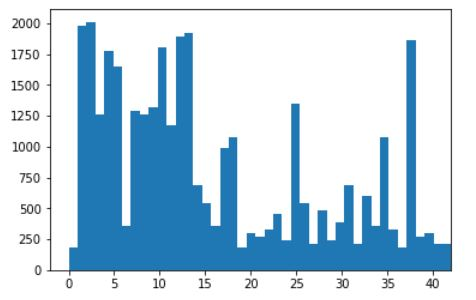

### Design and Test a Model Architecture

#### Preprocessing

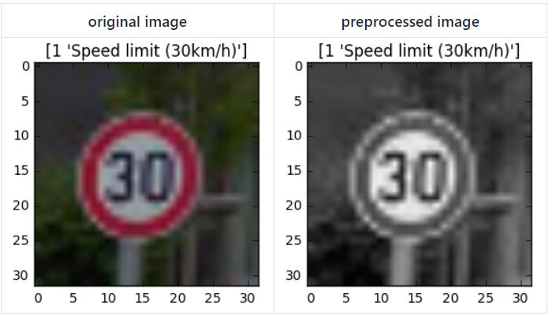

The traffic sign dataset is an RGB image, i.e it has 3 channels. Converting it to a single channel image (YCrCb image space) makes the model training faster and at the same time do not disregard most of the information embedded in the image. In addition to gray scale conversion, the image data is normalized.

Training set after Preprocessing stage:

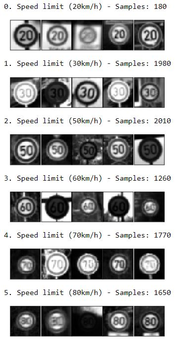

#### Model Architecture

In this project, a Convolution Neural Network is built and trained to classify the traffic signs. The input to the network is a 32x32x1 image and the output is the probabilty of each of the 43 possible traffic signs.

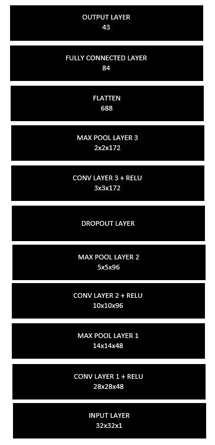

#### Approach and Challenges

The LeNet5 architecture was chosen as the starting point with the input layer and the output layer shape modified to fit the training data dimensions. With the epochs set to 10 and learning rate set to 0.001, the model gave a validation accuracy of 84% and a test accuracy of 78%. The performance was really low and did not meet the project requirements. Since the validation accuracy was climbing slowly, I increased the number of epochs to 25, but failed to obtain an accuracy above 90%. I experimented with the learning rate and tried adding more convolution layers and dropout layers to achieve a final validation accuacy of 97.9%.

The validation accuracy did oscillate a bit near the end of 25 epochs which is an indication of overfitting. A future improvement would be to augment the training dataset

#### Model Training Parameters

* EPOCHS = 25
* BATCH_SIZE = 128
* MU = 0
* SIGMA = 0.1
* LEARNING RATE = 0.001
* OPIMIZER: AdamOptimizer 

#### Model Training Results

* Validation Accuracy = **97.9%**
* Test Accuracy = **95.8%**

### Testing the model on new images

Downloaded 5 commonly seen traffic sign images, that were not used while training the model, from the web and tested the model on them. 

| Name			        |     Sign	        					| 
|:---------------------:|:---------------------------------------------:| 
| General caution       | |    
| Speed limit 30        |    |   
| Speed limit 60        |   |    
| Keep right            |    |   
| Turn left ahead       |     |    

#### Performance on New Images

| Image			        |     Prediction	        					| 
|:---------------------:|:---------------------------------------------:| 
| General caution      		| General caution   									| 
| Speed limit 60     			| Speed limit 60 										|
| Speed limit 30					| Speed limit 30											|
| Keep right	      		| Keep right					 				|
| Turn left ahead			| Turn left ahead      							|

The model was able to correctly predict all 5 of the 5 traffic signs, which gives an accuracy of 100%. 

#### Softmax Probabilities

The below chart shows the top 5 prediction probabilities for the new test images

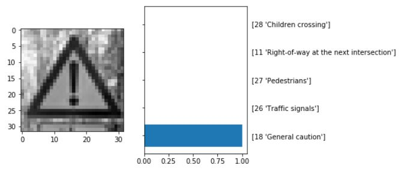

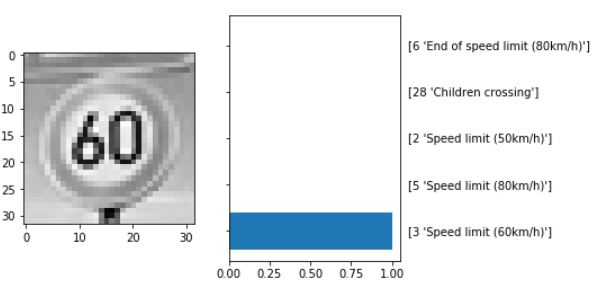

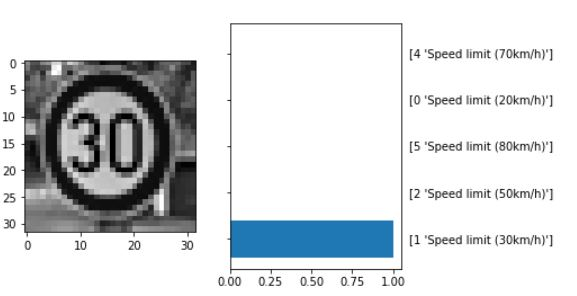

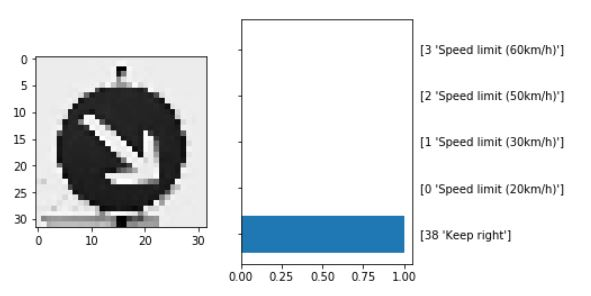

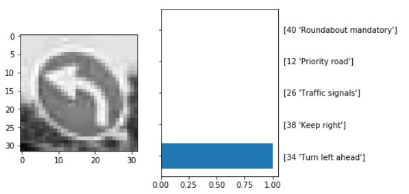

### Visualizing the Neural Network 

Input image

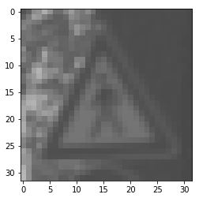

The below figure shows the visual output of the trained networks feature maps in the convolution layer 1 which has a depth of 48.

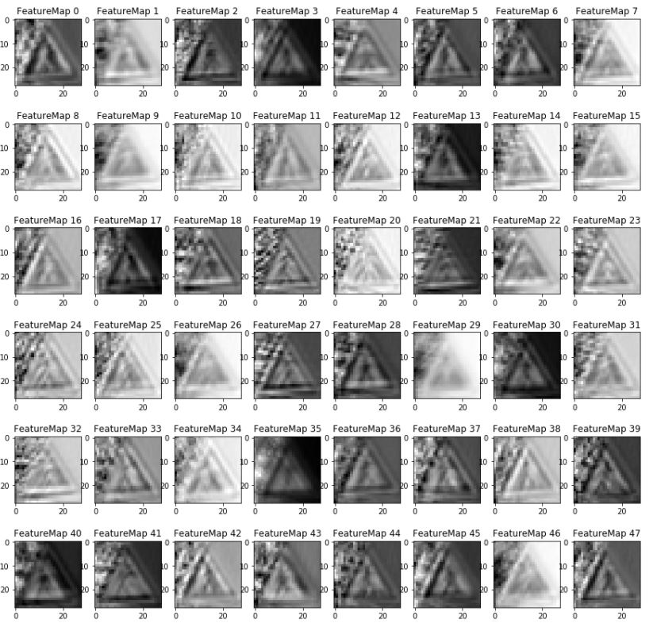

